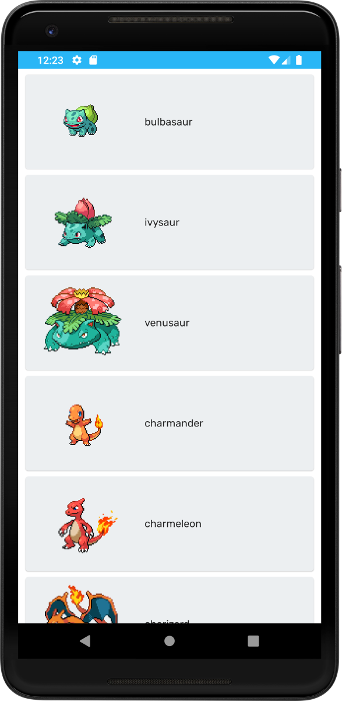

# Poke Deck

Poke Deck is a simple pokemon card application built with kotlin and jetpack compose.

## Roadmap

- Pokemons
- Items
- Stats
- Locations
- Contests
- Berries
- Evolution
## Acknowledgements

- [Pokemon API](https://pokeapi.co/docs/v2)

## Design
Screens are designed in Figma. 
You can check out the design process of the screens by clicking the link below.
**Note:** These designs may not be currently available in the app and can be regarded as upcoming designs
[Figma link](https://www.figma.com/file/9Eseg6WpJiq4MDjekLTAyK/PokeDeck?node-id=442%3A91)

## Screenshots

## Feedback

If you have any feedback, please reach out to me at aslansari.dev@gmail.com

  